# PulseStack Distributed Runtime Architecture

This document describes the distributed runtime architecture implemented in the PulseStack repository. It is written for contributors, infrastructure engineers, observability maintainers, and replay/runtime developers who need to understand service boundaries and execution flow before changing the system.

PulseStack is actively evolving. This document separates implemented behavior from planned or partial behavior where the code exposes contracts or schemas but does not yet provide a full production implementation.

## 1. System Overview

PulseStack is a TypeScript monorepo for AI workflow execution, event capture, trace storage, graph inspection, and replay. The runtime is split into independently deployable Fastify services that share contracts and infrastructure access through `packages/core`.

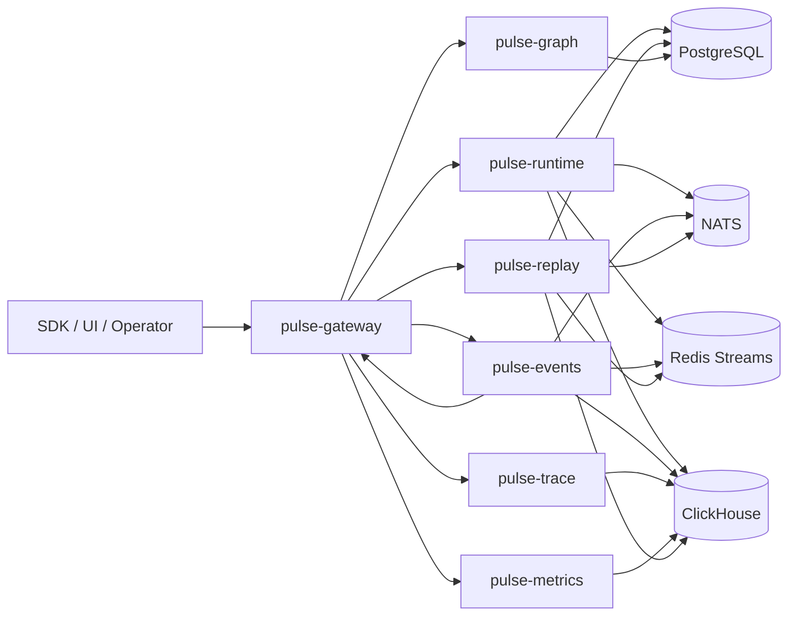

The shared runtime model is defined by `@pulsestack/contracts`:

- `WorkflowDefinition`: workflow metadata plus ordered `steps`.
- `WorkflowStep`: a unit of work with `id`, `kind`, `dependsOn`, and `input`.
- `ExecutionRequest`: workflow plus initial input and initiator.
- `EventEnvelope`: normalized runtime event format.
- `TraceSpan`: span record persisted to ClickHouse.
- `ExecutionSnapshot`: state checkpoint and side-effect record.
- `PluginManifest`: plugin metadata and declared capabilities.

### Runtime Purpose

`pulse-runtime` owns workflow execution. It validates workflow definitions, creates execution records, emits lifecycle events, writes step spans, records snapshots, and completes executions. It currently performs execution in-process through `WorkflowRuntime.execute()`.

The runtime engine is designed around three durable records:

- PostgreSQL workflow/execution rows for control-plane state.
- PostgreSQL snapshots for replay checkpoints.
- ClickHouse event/span rows for analytics and trace timelines.

### Distributed Execution Model

The current implementation is distributed at the service and telemetry layers:

- Requests enter through `pulse-gateway`.
- Workflow execution runs inside `pulse-runtime`.
- Runtime events are fanned out through NATS, appended to Redis Streams, and inserted into ClickHouse.
- Trace, metrics, graph, replay, and event streaming are separate services.
- Gateway exposes a stable API facade over those service boundaries.

Step execution itself is currently synchronous and sequential. The workflow validator understands DAG dependencies, and the graph service reconstructs edges from `dependsOn`, but the executor iterates over `workflow.steps` in request order rather than performing topological parallel scheduling. Parallel DAG scheduling is therefore an architectural direction, not current behavior.

### Orchestration Philosophy

PulseStack favors explicit event envelopes, durable checkpoints, and queryable execution state over hidden scheduler state. Runtime behavior is observable by default: every workflow start/completion, tool call, LLM request, replay operation, and span recording passes through a shared event pipeline.

## 2. Runtime Lifecycle

### Implemented Request Lifecycle

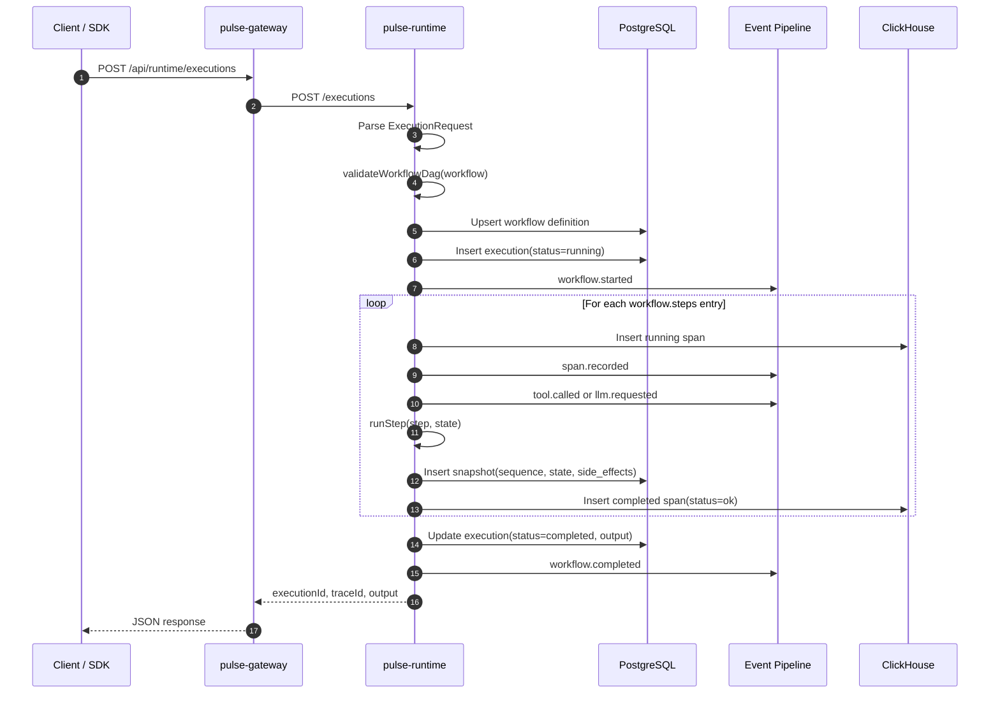

The main execution path lives in `WorkflowRuntime.execute()`:

1. Parse and validate the `ExecutionRequest`.
2. Validate the DAG shape with `validateWorkflowDag()`.
3. Generate `executionId` and `traceId`.
4. Persist the workflow definition.
5. Insert an execution row with status `running`.
6. Emit `workflow.started`.
7. Iterate through `workflow.steps`.
8. For each step, write a running span and emit `span.recorded`.
9. Run the synthetic step implementation for `agent`, `tool`, `llm`, `queue`, `memory`, or `trigger` step kinds.
10. Merge the step output into the in-memory state under `state[step.id]`.
11. Persist a snapshot with state and side-effect metadata.
12. Write the completed span.
13. Update the execution row to `completed`.
14. Emit `workflow.completed`.

### Execution State Transitions

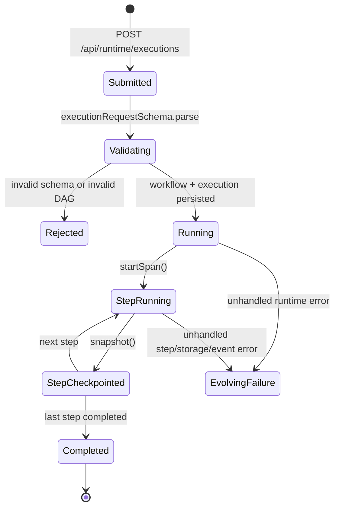

Only `running` and `completed` are currently written by the runtime. The contracts include `workflow.failed` and `tool.failed` event types, but the executor does not yet wrap step execution in retry/failure handling or persist a terminal `failed` status on exceptions. Contributors should treat failure transitions as evolving behavior.

### DAG Traversal and Scheduling

The repository implements DAG validation, not a full DAG scheduler.

The validator checks:

- duplicate step IDs
- dependencies referencing missing steps
- at least one entry node
- dependency cycles
- disconnected steps unreachable from any entry node

The executor then runs `workflow.steps` in array order. This is deterministic for a given request payload, but it does not currently enforce dependency order during scheduling beyond validation. Workflow authors should order steps topologically until the runtime gains dependency-aware scheduling.

## 3. Distributed Event Pipeline

PulseStack uses a single event publishing function, `publishEvent(infra, event)`, which delegates to `PulseInfra.writeEvent()`.

```mermaid
flowchart TD
  Producer[pulse-runtime / pulse-events / pulse-replay] --> CreateEvent[createEvent()]
  CreateEvent --> Envelope[EventEnvelope v1]
  Envelope --> WriteEvent[PulseInfra.writeEvent()]
  WriteEvent --> NATS[NATS subject pulse.events.type]
  WriteEvent --> Redis[Redis Stream pulse:events]
  WriteEvent --> CH[ClickHouse events table]
  NATS --> WS[pulse-events /stream websocket]
  WS --> Gateway[pulse-gateway /ws/events]
  Gateway --> UI[pulse-web / clients]
  CH --> Recent[pulse-events /recent]
  CH --> Metrics[pulse-metrics /summary]
```

### Event Envelope

Every event is schema-validated with these fields:

- `id`
- `version`
- `type`
- `source`
- `tenantId`
- `correlationId`
- optional `workflowId`
- optional `executionId`
- optional `spanId`
- optional `parentSpanId`
- `timestamp`
- `payload`
- `tags`

Implemented event types include workflow lifecycle, tool/LLM runtime signals, replay lifecycle, queue/memory/trigger placeholders, and span recording.

### Producers

```mermaid
graph TD
  Runtime[pulse-runtime] --> Started[workflow.started]
  Runtime --> Span[span.recorded]
  Runtime --> Tool[tool.called]
  Runtime --> LLM[llm.requested]
  Runtime --> Completed[workflow.completed]

  Events[pulse-events] --> Manual[/emit/:type]
  Events --> Ingest[/ingest]

  Replay[pulse-replay] --> ReplayStarted[replay.started]
  Replay --> ReplayCompleted[replay.completed]
```

`pulse-events` accepts externally supplied events through `/ingest` and manual event creation through `/emit/:type`. Both paths route through the same publisher as runtime-generated events.

### Propagation Semantics

`PulseInfra.writeEvent()` performs three writes:

1. Publish to NATS subject `pulse.events.${event.type}`.
2. Append the serialized event to Redis Stream `pulse:events`.
3. Insert an analytics row into ClickHouse table `events`.

There is no explicit transactional boundary across NATS, Redis, and ClickHouse. A partial write can occur if one downstream system accepts the event and another fails. The current code does not implement outbox replay or dead-letter queues. The Redis stream is available as an append-only buffer, but no consumer group or DLQ service is implemented yet.

### Consumer Lifecycle

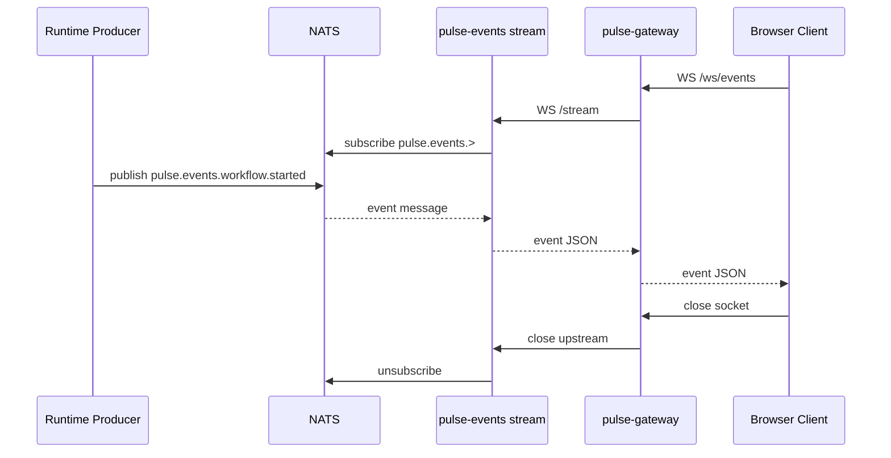

## 4. DAG Execution Engine

### Workflow Shape

A workflow is an ordered array of steps with explicit dependencies:

```json
{
  "steps": [
    { "id": "trigger", "kind": "trigger", "dependsOn": [] },
    { "id": "plan", "kind": "agent", "dependsOn": ["trigger"] },
    { "id": "fetch", "kind": "tool", "dependsOn": ["plan"] },
    { "id": "summarize", "kind": "llm", "dependsOn": ["fetch"] }
  ]
}
```

The validator converts this into adjacency and incoming-count maps for structural checks:

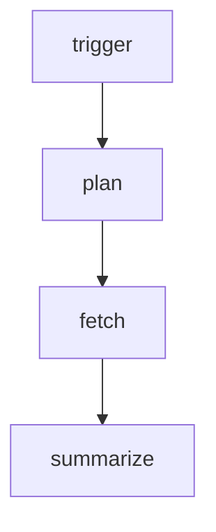

### Dependency Resolution

Validation constructs:

- `stepIds`: all known step IDs.
- `adjacency`: dependency-to-dependent edges.
- `incomingCount`: number of dependencies for each step.
- `entryNodes`: steps with no incoming dependencies.
- `reachable`: nodes reachable by breadth-first traversal from entry nodes.

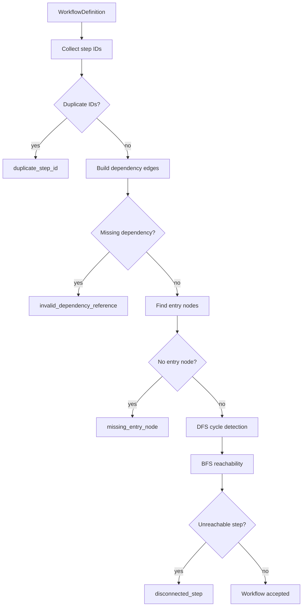

### Node Scheduling

Current scheduling is a deterministic array traversal:

```mermaid
flowchart LR
  S0[Initial state] --> A[steps[0]]
  A --> S1[state + output under step id]
  S1 --> B[steps[1]]
  B --> S2[state + output under step id]
  S2 --> C[steps[n]]
  C --> Final[Execution output]
```

The runtime does not yet maintain ready queues, worker leases, distributed locks, or per-node retry state. Event types such as `queue.enqueued` and `queue.processed` exist in contracts for future scheduling and worker integration.

### Failure Isolation

Step execution is isolated in code by `runStep()`, but not yet isolated in a process, container, sandbox, or remote worker. The current step runner emits synthetic outputs:

- `llm`: emits `llm.requested`, returns synthetic text and token count.
- `tool`: emits `tool.called`, returns an echoed tool result.
- other step kinds: return a processed status.

Because the runner is synchronous and in-process, a thrown exception can abort the request and leave the execution row in `running`. Production-grade failure isolation is a future runtime concern.

## 5. Replay Architecture

Replay is built from persisted snapshots. The runtime writes a snapshot after each step with:

- snapshot ID
- execution ID
- workflow ID
- sequence number
- complete state at that point
- recorded side effects for that step
- creation timestamp

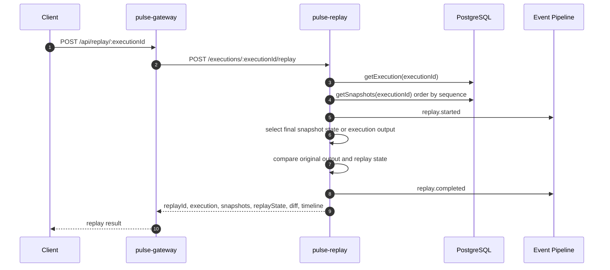

### Checkpoint Model

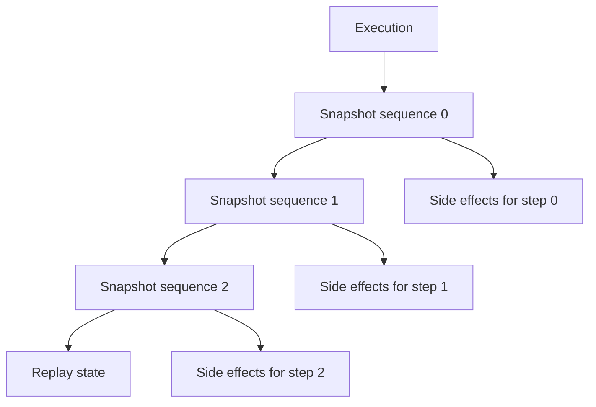

The implemented replay engine does not re-execute workflow steps. It reconstructs the replay state from the final snapshot, or falls back to the execution output if no snapshots are available. The returned diff compares top-level keys and JSON equality between the original execution output and replay state.

### Deterministic Replay Boundary

PulseStack already records enough structure to support deterministic reconstruction:

- Ordered snapshots.
- Step side-effect responses.
- Workflow definitions stored in PostgreSQL.
- Event timelines in ClickHouse.
- Correlation IDs and execution IDs across records.

The current implementation is checkpoint replay, not a Temporal-style command/event replayer. Contributors working on deterministic replay should extend the snapshot timeline into a stricter replay log with side-effect suppression and versioned workflow definitions.

### Recovery Lifecycle

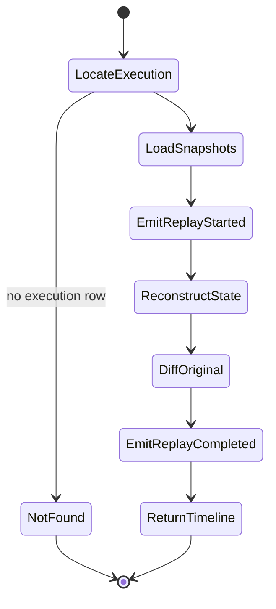

## 6. Observability & Tracing

PulseStack records trace-like spans but does not currently initialize the OpenTelemetry SDK or export OTLP spans. The documentation and roadmap refer to OpenTelemetry integration, and the span model is compatible with future OTEL adapters, but implemented tracing is a custom ClickHouse-backed span pipeline.

### Span Lifecycle

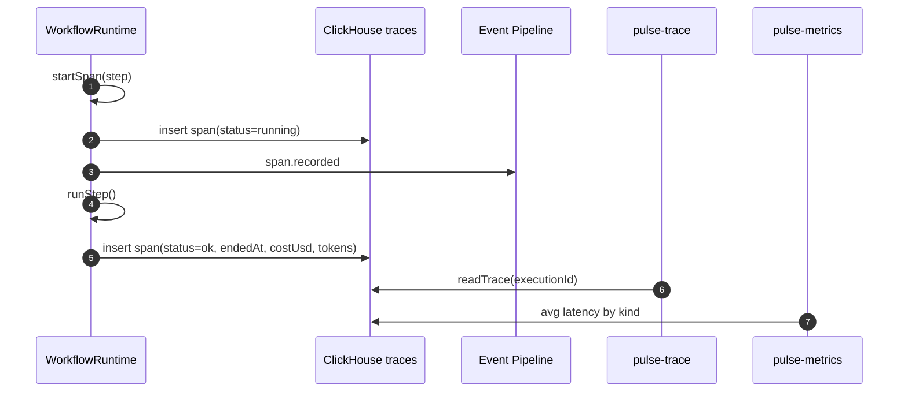

A running span is written before step execution, then a second row is written with the same `spanId` and status `ok` after the step finishes. The traces table is append-oriented; the runtime does not update the original row.

### Trace Attributes

The runtime attaches:

- dependency list from `step.dependsOn`
- current state keys at span start
- step ID
- cost in USD
- token count

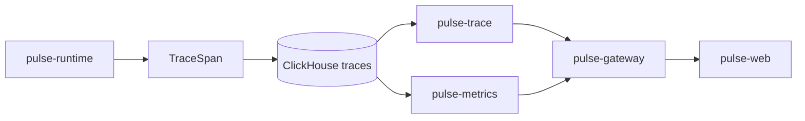

### Metrics Flow

`pulse-metrics` queries ClickHouse for:

- event counts grouped by type
- average trace latency grouped by span kind

The current metrics layer is read-only and query-driven. It does not yet expose Prometheus metrics, OTEL metrics, SLO burn rates, or service health rollups.

## 7. Service Communication

### HTTP and WebSocket Boundaries

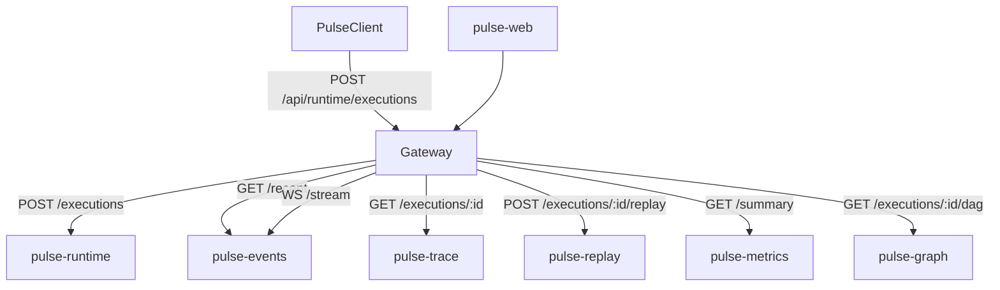

`pulse-gateway` performs API-key/JWT checks for `/api/*` routes when `AUTH_DISABLED` is false. It proxies JSON requests to backend services with `undici` and bridges browser event websockets to `pulse-events`.

### gRPC Boundary

`pulse-runtime` also starts a gRPC server from `proto/pulsestack.proto`. The implemented RPC is:

- `Runtime.GetExecution(GetExecutionRequest) returns ExecutionReply`

This returns execution ID, workflow ID, status, and correlation ID. gRPC is currently a narrow read path, while workflow submission uses HTTP.

### Persistence Contracts

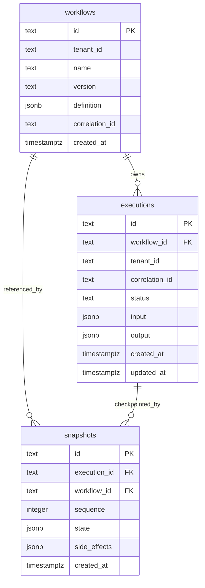

ClickHouse stores high-volume analytics:

- `events`: event envelopes, payload JSON, tags JSON.
- `traces`: span records, attributes JSON, status, timing data.

## 8. Plugin Architecture

PulseStack includes a plugin manifest schema, a plugin SDK package, and a loader in `packages/core/src/lib/plugins.ts`.

### Implemented Plugin Loading

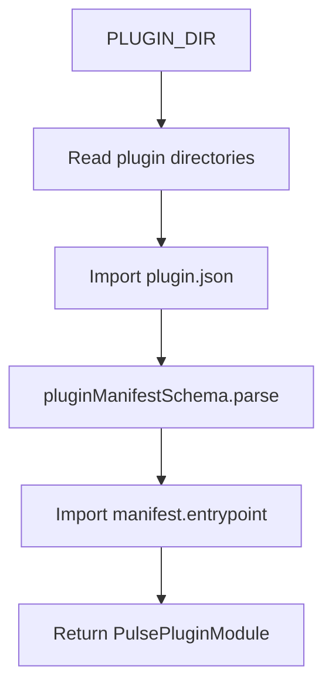

The sample `plugins/audit-log` plugin declares `event-handler` capability and exports `onEvent(event)`.

### Current Extension Boundary

The loader can discover plugin modules, but no service currently calls `loadPlugins()` or dispatches runtime events to plugin `onEvent` hooks. The plugin architecture is therefore scaffolded, not active in the runtime event pipeline.

Planned extension points implied by contracts and SDK types:

- event handlers
- telemetry exporters
- workflow adapters
- storage adapters
- tracing adapters

Future plugin work should define:

- plugin dispatch ownership, likely in `pulse-events` or a dedicated plugin host
- hook ordering and error isolation
- tenant/context propagation
- sandbox boundaries for untrusted plugins
- retry/DLQ behavior for plugin hook failures

## 9. Failure Recovery Model

### Implemented Behavior

PulseStack currently provides recovery primitives:

- durable execution rows
- durable workflow definitions
- per-step snapshots
- append-only event and trace analytics
- replay reconstruction from snapshots
- Redis stream copy of every event

These records make failed or inconsistent runs inspectable even though the runtime failure policy is still evolving.

### Current Failure Gaps

The following are not yet implemented:

- step retry policy
- exponential backoff
- dead-letter queue
- failed execution finalization
- `workflow.failed` publication from executor exceptions
- `tool.failed` publication from tool runner exceptions
- Redis consumer groups for replaying event delivery
- distributed worker leases
- idempotency keys for event writes
- transaction/outbox coupling between PostgreSQL execution state and event publication

### Recovery Path Today

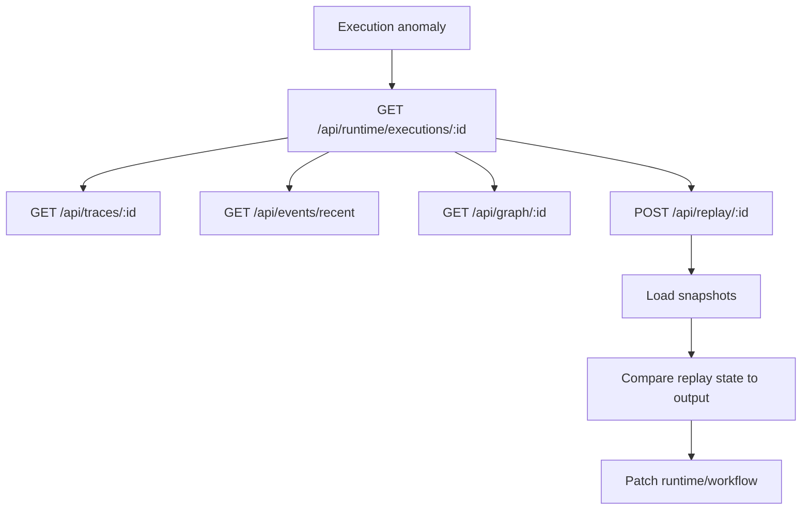

Future failure recovery should promote these primitives into an explicit state machine with retries, terminal failure status, and operator-driven replay/resume workflows.

## 10. Future Scaling Considerations

The current architecture already separates gateway, runtime, event streaming, trace reads, replay, metrics, and graph reads. The next scaling work should preserve those boundaries while making execution and recovery more robust.

### Runtime Scheduling

- Replace array-order execution with topological scheduling.
- Introduce ready queues per workflow execution.
- Support parallel execution for independent nodes.
- Persist per-step status and attempts.
- Add worker lease/heartbeat records for distributed runners.
- Make step execution idempotent by `(executionId, stepId, attempt)`.

### Event Durability

- Add a PostgreSQL outbox or transactional event log for workflow lifecycle events.
- Add Redis consumer groups or a NATS JetStream-backed durable subscription layer.
- Define DLQ subjects/streams for failed consumers.
- Add event write retries and partial-write diagnostics.
- Store event publication attempt metadata.

### Replay and Recovery

- Version workflow definitions for replay compatibility.
- Record deterministic commands and side effects as a replay log.
- Rebuild state by folding snapshots/events rather than selecting only the final snapshot.
- Add resume-from-checkpoint semantics.
- Distinguish diagnostic replay from recovery replay.

### Observability

- Add real OpenTelemetry SDK initialization and OTLP export.
- Map `TraceSpan` to OTEL span attributes.
- Add service-level metrics and Prometheus-compatible endpoints.
- Add trace parent/child relationships for workflow-level and step-level spans.
- Add error spans and structured exception events.

### Plugin Isolation

- Run plugins in a dedicated host or worker context.
- Define capability-based permissions.
- Add per-plugin timeouts, retries, and circuit breakers.
- Route event hooks through a durable queue.
- Support sandboxing for untrusted extension code.

### Control Plane

- Add richer auth/RBAC around tenant and workflow access.
- Add workflow version migration policies.
- Add deployment-time health checks for PostgreSQL, Redis, NATS, and ClickHouse.
- Add Kubernetes operator patterns for runtime services if PulseStack starts managing workflow workers directly.
